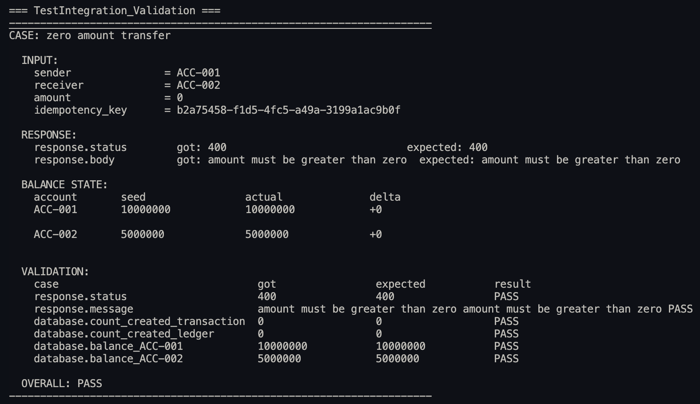
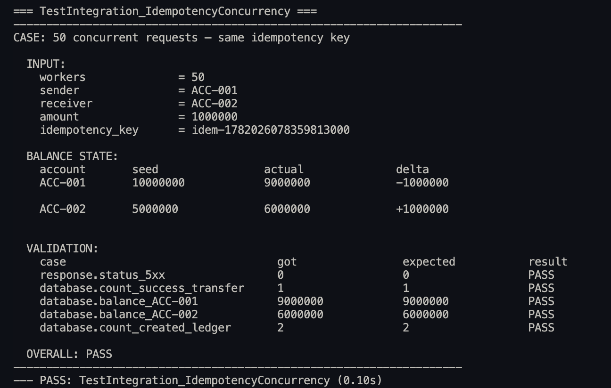
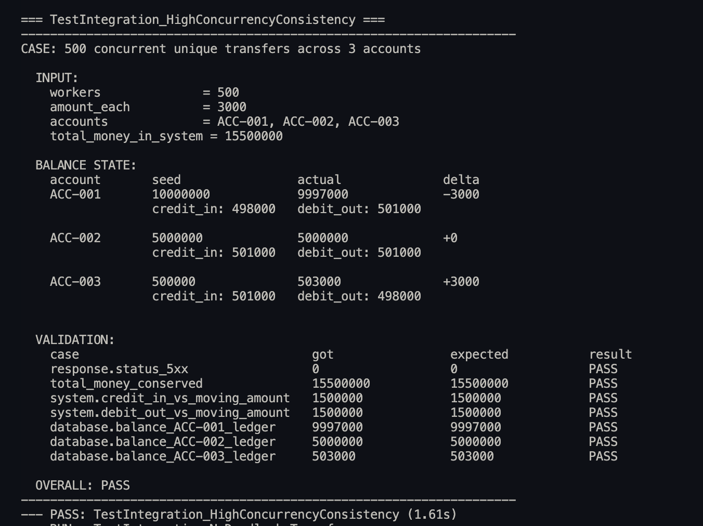
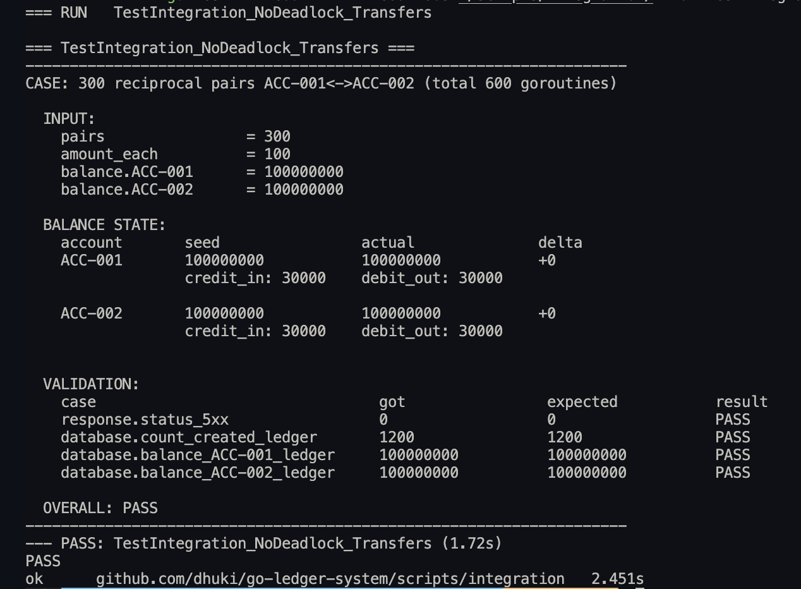

# Ledger System Apps

A backend service that manages bank ledger records using double-entry bookkeeping. Every transaction posts matching debit and credit entries atomically, ensuring balances always remain consistent.

---

## 1. Decision Flow Architecture

### CAP Theorem — Consistency over Availability

A bank ledger has zero tolerance for balance drift. A transfer that debits without crediting, or that is applied twice, is a fundamental failure. Under the CAP theorem this system explicitly chooses **Consistency over Availability**: a request will be rejected or made to wait rather than risk an incorrect balance.

---

### Consistency Strategy

Two layers of pessimistic control enforce exactly-once semantics for every transfer.

```
HTTP Request
       │
       ▼
  ┌─────────────────────────────────────────────────────────────┐
  │  LAYER 1 — Redis SetNX  (service layer)                     │
  │  Atomically claims the idempotency key before any DB work.  │
  │  Only the winner proceeds; all concurrent duplicates stop   │
  │  here and never touch the database.                         │
  └──────────────────────────┬──────────────────────────────────┘
                             │
              ┌──────────────┴──────────────┐
         SetNX blocked              SetNX unblocked
              │                             │
  ┌───────────▼──────────────┐              │
  │  GetTransferByReferenceID│              │
  ├──────────────────────────┤              │
  │ Found → return existing  │              │
  │ Not found (in-flight)    │              │
  │   → ErrStillProcessing   │              │
  └───────────────────────── ┘              │
                                            ▼
                              ┌─────────────────────────────┐
                              │  BEGIN TRANSACTION          │
                              │                             │
                              │  LAYER 2 — SELECT FOR UPDATE│
                              │  ORDER BY account_number    │
                              │  (row-level pessimistic lock│
                              │   on both accounts at once) │
                              │                             │
                              │  Validate sender balance    │
                              │                             │
                              │  GetTransferByReferenceID   │
                              │  (safety re-check under lock│
                              │   guards against Redis TTL  │
                              │   expiry edge case)         │
                              │                             │
                              │  UPDATE account balances    │
                              │  INSERT transfer record     │
                              │  INSERT ledger entries (×2) │
                              │                             │
                              │  COMMIT                     │
                              └─────────────────────────────┘
                                            │
                                    defer Del Redis key
```

---

#### Layer 1 — Redis `SetNX` (service layer)

`SetNX` atomically writes the idempotency key with a TTL before any database work begins. Only the request that wins the write proceeds; all concurrent duplicates are intercepted here.

| SetNX result                                      | What happens                                                                                                                                                                                                                                                               |
| ------------------------------------------------- | -------------------------------------------------------------------------------------------------------------------------------------------------------------------------------------------------------------------------------------------------------------------------- |
| **Unblocked** — key was free               | Proceeds to the database transaction                                                                                                                                                                                                                                       |
| **Blocked — transfer already committed**   | `GetTransferByReferenceID` finds the existing row → returns it as an idempotent replay, no DB write. Isolation level Read Commited also make `tx.GetTransferByReferenceID` will also return commited process and handled by validation if same transfer already exist |
| **Blocked — transfer still in-processing** | First request still holds the key and has not committed yet → returns `ErrTransferStillProcessing`                                                                                                                                                                      |

The key is released via `defer Del` once the first request finishes, so callers that received `ErrTransferStillProcessing` can safely retry after a brief wait.

---

#### Layer 2 — `SELECT FOR UPDATE ORDER BY account_number` (repository layer)

Inside the database transaction, both accounts are locked in a single query using `FOR UPDATE`. This is the fallback guard for any scenario where Redis is bypassed or the key expires early.

```sql
SELECT ... FROM account_balances
WHERE account_number IN ($1, $2)
ORDER BY account_number
FOR UPDATE
```

The `ORDER BY account_number` is **the deadlock prevention mechanism**. Every transfer regardless of direction acquires row locks in the same alphabetical order.

**Without ordering**, A→B and B→A transfers deadlock:

```
TX1 (A→B): locks ACC-001, waits for ACC-002
TX2 (B→A): locks ACC-002, waits for ACC-001  ← circular wait → deadlock
```

**With `ORDER BY account_number`**, both transactions acquire locks in the same sequence:

```
TX1 (A→B): locks ACC-001 first, then ACC-002
TX2 (B→A): locks ACC-001 first (waits), then ACC-002  ← no circular wait → no deadlock
```

#### Safety re-check under the row lock

After acquiring the row locks, the service runs a second `GetTransferByReferenceID` inside the transaction. This handles a narrow edge case: if the Redis key TTL expires between the `SetNX` claim and the database commit, a second concurrent request may win its own `SetNX` and reach the transaction. The under-lock idempotency check catches this before any writes occur and returns the existing result rather than double-processing.

---

## 2. Running with Docker

### Prepare configuration

Copy the example file and fill in your values:

```bash
cp .env.example .env
```

Required values in `.env`:

```env
# Application
APP_NAME=go-ledger-system
REST_PORT=8080
GRACEFUL_TIMEOUT=30s

# PostgreSQL
POSTGRES_HOST=localhost
POSTGRES_PORT=5432
POSTGRES_DBNAME=ledger_system
POSTGRES_USERNAME=postgres
POSTGRES_PASSWORD=your_password
POSTGRES_SSL_MODE=disable
POSTGRES_MIGRATION_DIR=internal/infra/database/repository/domain/migration
POSTGRES_MAX_CONNECTION=10
POSTGRES_MAX_IDLE_CONNECTION=5
POSTGRES_MAX_DURATION_IDLE_CONN=5m
POSTGRES_MAX_DURATION_LIFETIME_CONN=1h

# Redis
REDIS_HOST=localhost
REDIS_PORT=6379
REDIS_PASSWORD=
REDIS_DB=0
REDIS_TRANSFER_IDEMPOTENCY_TTL=1h
```

> 💡 **Tip — `POSTGRES_HOST` and `REDIS_HOST`:** These values in `.env` are only used when running the app locally. Docker Compose overrides them to `postgres` and `redis` so the app container resolves correctly within the Docker network.

> ⚠️ **Warning — `POSTGRES_MIGRATION_DIR` must not be changed.** The Dockerfile bakes the migration files into the container at the fixed path `internal/infra/database/repository/domain/migration`. If you change this value the app will fail to find the migration files on startup and will exit immediately.

> ⚠️ **Warning — changing PostgreSQL credentials on an existing volume will crash the app.** PostgreSQL only reads `POSTGRES_DBNAME`, `POSTGRES_USERNAME`, and `POSTGRES_PASSWORD` when initializing a brand-new data directory. If the `postgres_data` Docker volume already exists from a previous `make up`, restarting with different credentials leaves the old ones intact in the volume while the app tries to connect with the new ones — causing an authentication failure and a failed startup. To apply new credentials safely, remove the volume first:
>
> ```bash
> make down
> docker volume rm go-ledger-system_postgres_data
> make up
> ```

### Start all services

```bash
make up
```

This builds the app image and starts three containers:

| Container                    | Role          | Exposed port        |
| ---------------------------- | ------------- | ------------------- |
| `go-ledger-system-psql`    | PostgreSQL 16 | `5432`, `15432` |
| `go-ledger-system-redis`   | Redis 7       | `6379`            |
| `go-ledger-system-service` | Application   | `8080`            |

The app waits for PostgreSQL and Redis health checks to pass before starting. Database migrations run automatically on startup.

### Lifecycle commands

```bash
make up         # build and start all services
make down       # stop and remove all containers
make restart    # down + rebuild + up
```

---

### Calling the endpoints

Base URL: `http://localhost:8080`

#### Health check

```bash
curl -s http://localhost:8080/api/v1/health | jq
```

Expected response:

```json
{
  "status": 200,
  "message": "ok",
  "data": null
}
```

#### Create a fund transfer

```bash
curl -s -X POST http://localhost:8080/api/v1/transfer \
  -H "Content-Type: application/json" \
  -H "X-Idempotency-Key: unique-key-001" \
  -H "X-Trace-ID: $(uuidgen)" \
  -d '{
    "sender_account": "ACC-001",
    "receiver_account": "ACC-002",
    "amount": 500000
  }' | jq
```

**Request headers**

| Header                | Required | Description                                                              |
| --------------------- | -------- | ------------------------------------------------------------------------ |
| `Content-Type`      | Yes      | Must be `application/json`                                             |
| `X-Idempotency-Key` | Yes      | Unique key per transfer intent; prevents duplicate processing on retries |
| `X-Trace-ID`        | Optional | UUID for request tracing across logs                                     |

**Request body**

| Field                | Type    | Description                                                                |
| -------------------- | ------- | -------------------------------------------------------------------------- |
| `sender_account`   | string  | Account number to debit                                                    |
| `receiver_account` | string  | Account number to credit                                                   |
| `amount`           | integer | Transfer amount in the smallest currency unit — must be greater than zero |

**Success response** (`200 OK`):

```json
{
  "status": 200,
  "message": "ok",
  "data": {
    "transaction_id": 1
  }
}
```

**Error responses**

| HTTP status                  | Cause                                                        |
| ---------------------------- | ------------------------------------------------------------ |
| `400 Bad Request`          | `amount` ≤ 0, or sender and receiver are the same account |
| `404 Not Found`            | Sender or receiver account does not exist                    |
| `422 Unprocessable Entity` | Sender has insufficient balance                              |

## 3. Running Integration Tests

Integration tests run against live Docker containers and verify end-to-end behaviour including idempotency, concurrency consistency, and deadlock prevention.

### Prerequisites

- All Docker containers must be running (`make up`).
- The test uses port `15432` (the extra PostgreSQL port exposed by Docker Compose) to connect directly to the database for assertions and state resets.

### Run

```bash
make test-integration
```

The Makefile sets `DOCKER_PSQL_DSN` automatically. To run manually with a custom DSN:

```bash
DOCKER_PSQL_DSN="host=localhost port=15432 dbname=<dbname> user=<user> password=<password> sslmode=disable" \
  go test -v -count=1 -timeout=60s ./scripts/integration/...
```

To run a single test suite, append `-run <TestName>`:

```bash
# Validation only
DOCKER_PSQL_DSN="host=localhost port=15432 dbname=<dbname> user=<user> password=<password> sslmode=disable" \
  go test -v -count=1 -timeout=60s ./scripts/integration/... -run TestIntegration_Validation

# Idempotency & concurrency only
DOCKER_PSQL_DSN="host=localhost port=15432 dbname=<dbname> user=<user> password=<password> sslmode=disable" \
  go test -v -count=1 -timeout=60s ./scripts/integration/... -run TestIntegration_IdempotencyConcurrency

# High-concurrency consistency only
DOCKER_PSQL_DSN="host=localhost port=15432 dbname=<dbname> user=<user> password=<password> sslmode=disable" \
  go test -v -count=1 -timeout=60s ./scripts/integration/... -run TestIntegration_HighConcurrencyConsistency

# Deadlock prevention only
DOCKER_PSQL_DSN="host=localhost port=15432 dbname=<dbname> user=<user> password=<password> sslmode=disable" \
  go test -v -count=1 -timeout=60s ./scripts/integration/... -run TestIntegration_NoDeadlock_Transfers
```

> ⚠️ **Warning:** The credentials in `DOCKER_PSQL_DSN` (`user`, `password`, `dbname`) must exactly match the values you set in `.env` for `POSTGRES_USERNAME`, `POSTGRES_PASSWORD`, and `POSTGRES_DBNAME`. A mismatch will cause the test to fail to connect to the database inside the Docker container. Double-check your `.env` before running.

### What the tests cover

| Test                                           | Description                                                                                      |
| ---------------------------------------------- | ------------------------------------------------------------------------------------------------ |
| `TestIntegration_Validation`                 | Rejects zero amount, self-transfer, unknown sender, and insufficient balance                     |
| `TestIntegration_IdempotencyConcurrency`     | 50 concurrent requests sharing one idempotency key — exactly one transfer must be persisted     |
| `TestIntegration_HighConcurrencyConsistency` | 300 concurrent unique transfers across 3 accounts — total money in the system must be conserved |
| `TestIntegration_NoDeadlock_Transfers`       | 150 reciprocal A→B / B→A pairs fired simultaneously — no deadlocks, no 5xx responses          |

> ⚠️ **Warning:** Each test truncates `ledger_entries` and `transaction_transfers` and resets account balances before running. Do not point `DOCKER_PSQL_DSN` at a database with data you want to keep.

---

## 4. Integration Test Results

Run with `make test-integration`. All four suites pass. Screenshots are provided alongside the captured output for each suite.

---

### Validation test

Verifies that malformed or invalid requests are rejected before touching the database — zero amount, self-transfer, unknown sender, unknown receiver, and insufficient balance.



<details>
<summary>Test output</summary>

```
=== RUN   TestIntegration_Validation

=== TestIntegration_Validation ===
--------------------------------------------------------------------
CASE: zero amount transfer

  INPUT:
    sender               = ACC-001
    receiver             = ACC-002
    amount               = 0
    idempotency_key      = 531f8b23-ca0e-472d-93b4-9986313e1bda

  RESPONSE:
    response.status        got: 400                             expected: 400
    response.body          got: amount must be greater than zero  expected: amount must be greater than zero

  BALANCE STATE:
    account       seed                actual              delta
    ACC-001       10000000            10000000            +0

    ACC-002       5000000             5000000             +0


  VALIDATION:
    case                                got                expected           result
    response.status                     400                400                PASS
    response.message                    amount must be greater than zero amount must be greater than zero PASS
    database.count_created_transaction  0                  0                  PASS
    database.count_created_ledger       0                  0                  PASS
    database.balance_ACC-001            10000000           10000000           PASS
    database.balance_ACC-002            5000000            5000000            PASS

  OVERALL: PASS
--------------------------------------------------------------------
--------------------------------------------------------------------
CASE: self transfer

  INPUT:
    sender               = ACC-001
    receiver             = ACC-001
    amount               = 100
    idempotency_key      = cbef267a-9e17-42f7-b863-623bb573f018

  RESPONSE:
    response.status        got: 400                             expected: 400
    response.body          got: cannot transfer to the same account  expected: cannot transfer to the same account

  BALANCE STATE:
    account       seed                actual              delta
    ACC-001       10000000            10000000            +0


  VALIDATION:
    case                                got                expected           result
    response.status                     400                400                PASS
    response.message                    cannot transfer to the same account cannot transfer to the same account PASS
    database.count_created_transaction  0                  0                  PASS
    database.count_created_ledger       0                  0                  PASS
    database.balance_ACC-001            10000000           10000000           PASS
    database.balance_ACC-001            10000000           10000000           PASS

  OVERALL: PASS
--------------------------------------------------------------------
--------------------------------------------------------------------
CASE: sender not found

  INPUT:
    sender               = ACC-999
    receiver             = ACC-002
    amount               = 100
    idempotency_key      = 8b123523-9c80-49a8-b220-76f41f38742c

  RESPONSE:
    response.status        got: 404                             expected: 404
    response.body          got: account not found               expected: account not found

  BALANCE STATE:
    account       seed                actual              delta
    ACC-999       0                   not found           -
    ACC-002       5000000             5000000             +0


  VALIDATION:
    case                                got                expected           result
    response.status                     404                404                PASS
    response.message                    account not found  account not found  PASS
    database.count_created_transaction  0                  0                  PASS
    database.count_created_ledger       0                  0                  PASS
    database.balance_ACC-002            5000000            5000000            PASS

  OVERALL: PASS
--------------------------------------------------------------------
--------------------------------------------------------------------
CASE: receiver not found

  INPUT:
    sender               = ACC-002
    receiver             = ACC-999
    amount               = 100
    idempotency_key      = 1cf6e5d1-a622-484c-a0c3-756ea2e7ca57

  RESPONSE:
    response.status        got: 404                             expected: 404
    response.body          got: account not found               expected: account not found

  BALANCE STATE:
    account       seed                actual              delta
    ACC-002       5000000             5000000             +0

    ACC-999       0                   not found           -

  VALIDATION:
    case                                got                expected           result
    response.status                     404                404                PASS
    response.message                    account not found  account not found  PASS
    database.count_created_transaction  0                  0                  PASS
    database.count_created_ledger       0                  0                  PASS
    database.balance_ACC-002            5000000            5000000            PASS

  OVERALL: PASS
--------------------------------------------------------------------
--------------------------------------------------------------------
CASE: insufficient balance

  INPUT:
    sender               = ACC-003
    receiver             = ACC-001
    amount               = 1
    idempotency_key      = 1407bd44-6444-4880-aa30-c036c227ee89

  RESPONSE:
    response.status        got: 422                             expected: 422
    response.body          got: insufficient balance            expected: insufficient balance

  BALANCE STATE:
    account       seed                actual              delta
    ACC-003       0                   0                   +0

    ACC-001       10000000            10000000            +0


  VALIDATION:
    case                                got                expected           result
    response.status                     422                422                PASS
    response.message                    insufficient balance insufficient balance PASS
    database.count_created_transaction  0                  0                  PASS
    database.count_created_ledger       0                  0                  PASS
    database.balance_ACC-003            0                  0                  PASS
    database.balance_ACC-001            10000000           10000000           PASS

  OVERALL: PASS
--------------------------------------------------------------------
--- PASS: TestIntegration_Validation (0.32s)
```

</details>

---

### Idempotency & concurrency test

50 goroutines fire the same transfer simultaneously using one idempotency key. Exactly one debit must be persisted regardless of how many requests reach the server.



<details>
<summary>Test output</summary>

```
=== RUN   TestIntegration_IdempotencyConcurrency

=== TestIntegration_IdempotencyConcurrency ===
--------------------------------------------------------------------
CASE: 50 concurrent requests — same idempotency key

  INPUT:
    workers              = 50
    sender               = ACC-001
    receiver             = ACC-002
    amount               = 1000000
    idempotency_key      = idem-1782034039067899000

  BALANCE STATE:
    account       seed                actual              delta
    ACC-001       10000000            9000000             -1000000
                  credit_in: 0        debit_out: 1000000

    ACC-002       5000000             6000000             +1000000
                  credit_in: 1000000  debit_out: 0


  VALIDATION:
    case                                got                expected           result
    response.status_5xx                 0                  0                  PASS
    database.count_success_transfer     1                  1                  PASS
    database.balance_ACC-001            9000000            9000000            PASS
    database.balance_ACC-002            6000000            6000000            PASS
    database.count_created_ledger       2                  2                  PASS

  OVERALL: PASS
--------------------------------------------------------------------
--- PASS: TestIntegration_IdempotencyConcurrency (0.09s)
```

</details>

---

### High-concurrency consistency test

500 goroutines perform unique transfers across 3 accounts in a circular pattern (ACC-001→ACC-002→ACC-003→ACC-001). Total money in the system must be conserved and the ledger must account for every credit and debit.

The `credit_in` and `debit_out` values under each account show the gross transfer volume. Because the pattern is circular each account sends and receives a similar total, keeping the net delta close to zero — this is by design and proves conservation, not stagnation.



<details>
<summary>Test output</summary>

```
=== RUN   TestIntegration_HighConcurrencyConsistency

=== TestIntegration_HighConcurrencyConsistency ===
--------------------------------------------------------------------
CASE: 500 concurrent unique transfers across 3 accounts

  INPUT:
    workers              = 500
    amount_each          = 3000
    accounts             = ACC-001, ACC-002, ACC-003
    total_money_in_system = 15500000

  BALANCE STATE:
    account       seed                actual              delta
    ACC-001       10000000            9997000             -3000
                  credit_in: 498000   debit_out: 501000

    ACC-002       5000000             5000000             +0
                  credit_in: 501000   debit_out: 501000

    ACC-003       500000              503000              +3000
                  credit_in: 501000   debit_out: 498000


  VALIDATION:
    case                                got                expected           result
    response.status_5xx                 0                  0                  PASS
    system.credit_in_vs_moving_amount   1500000            1500000            PASS
    system.debit_out_vs_moving_amount   1500000            1500000            PASS
    database.balance_ACC-001_ledger     9997000            9997000            PASS
    database.balance_ACC-002_ledger     5000000            5000000            PASS
    database.balance_ACC-003_ledger     503000             503000             PASS

  OVERALL: PASS
--------------------------------------------------------------------
--- PASS: TestIntegration_HighConcurrencyConsistency (1.74s)
```

</details>

---

### Deadlock prevention test

300 goroutines fire 150 reciprocal A→B / B→A pairs simultaneously. Consistent lock-acquisition order must prevent all deadlocks. Total money across both accounts must be conserved and the ledger must have exactly 2 entries per transfer.



<details>
<summary>Test output</summary>

```
=== RUN   TestIntegration_NoDeadlock_Transfers

=== TestIntegration_NoDeadlock_Transfers ===
--------------------------------------------------------------------
CASE: 300 reciprocal pairs ACC-001<->ACC-002 (total 600 goroutines)

  INPUT:
    pairs                = 300
    amount_each          = 100
    balance.ACC-001      = 100000000
    balance.ACC-002      = 100000000

  BALANCE STATE:
    account       seed                actual              delta
    ACC-001       100000000           100000000           +0
                  credit_in: 30000    debit_out: 30000

    ACC-002       100000000           100000000           +0
                  credit_in: 30000    debit_out: 30000


  VALIDATION:
    case                                got                expected           result
    response.status_5xx                 0                  0                  PASS
    database.count_created_ledger       1200               1200               PASS
    database.balance_ACC-001_ledger     100000000          100000000          PASS
    database.balance_ACC-002_ledger     100000000          100000000          PASS

  OVERALL: PASS
--------------------------------------------------------------------
--- PASS: TestIntegration_NoDeadlock_Transfers (3.67s)
PASS
ok      github.com/dhuki/go-ledger-system/scripts/integration   6.486s
```

</details>
